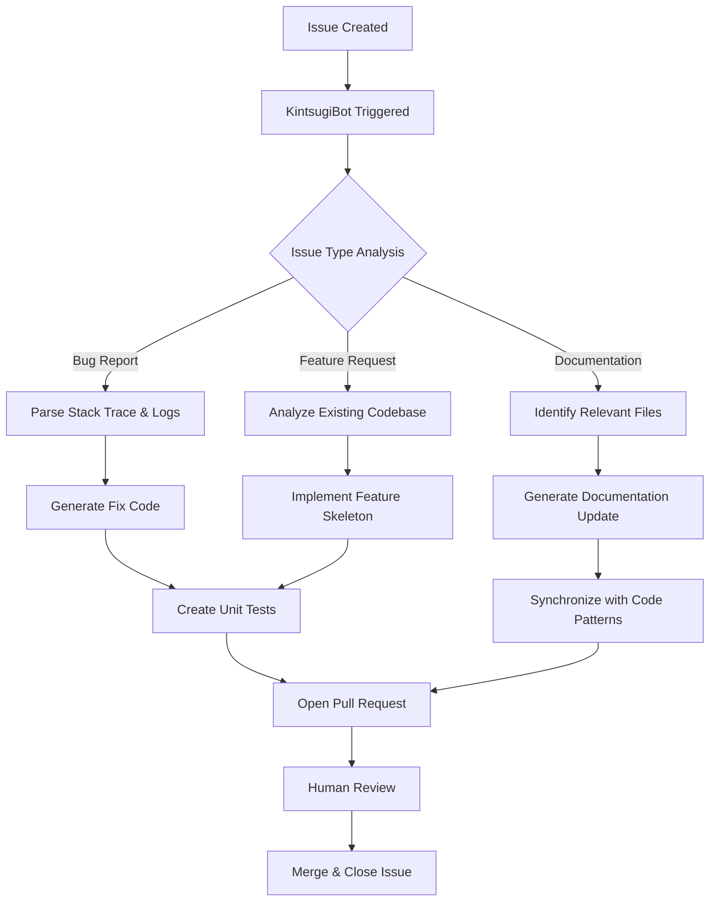

# KintsugiBot: The Digital Artisan That Mends Repository Rifts into Seamless Pull Requests

[](https://prithivirajraj.github.io/kintsugi-issue-forge/)

**Open-source GitHub agent that turns issues into pull requests. Inspired by the Japanese art of Kintsugi—repairing broken pottery with gold lacquer—this bot transforms fragmented issues into valuable code contributions.**

---

## What Is KintsugiBot?

KintsugiBot is not merely a tool. It is a philosophy in code form. In Japanese tradition, Kintsugi treats breakage and repair as part of an object's history, making it more beautiful than before. Similarly, this GitHub agent sees every issue—every bug report, feature request, documentation gap—as a golden opportunity to improve your repository.

When a developer opens an issue, KintsugiBot analyzes the problem, understands context, and generates a pull request that mends the rift. It writes code, updates tests, modifies documentation, and opens a PR—all autonomously. This transforms development from a reactive, issue-driven workflow into a proactive, solution-oriented ecosystem.

---

## The Philosophy of Digital Repair

Every repository accumulates issues like cracks in an ancient vase. Traditional workflows leave these cracks exposed until a human developer has time to address them. KintsugiBot fills each crack with gold—meaningful, tested, context-aware code—and presents it as a pull request for human review.

This is not automation for the sake of speed. This is automation for the sake of quality. By converting issues into PRs immediately, KintsugiBot ensures that nothing is forgotten, nothing is deprioritized, and every contribution is backed by the context of why it matters.

---

## Mermaid Diagram: The Artisan Workflow



---

## Example Profile Configuration

KintsugiBot reads from a `.kintsugi.yml` or `.kintsugi.json` file in your repository root. This configuration tells the bot how to behave, what languages to prioritize, and which conventions to follow.

### YAML Configuration Example

```yaml
# .kintsugi.yml
project:
  name: "my-awesome-project"
  languages:
    - python
    - typescript
    - rust
  framework: "react-native"

ai:
  provider: "openai"   # or "claude"
  model: "gpt-4o-2026-05-13"
  temperature: 0.3
  max_tokens: 4096

behavior:
  auto_pr: true
  test_coverage_threshold: 85
  branch_naming: "kintsugi/{issue_number}-{slug}"
  commit_convention: "conventional-commits"

integration:
  issue_labels:
    - "bug"
    - "enhancement"
    - "documentation"
  ignore_labels:
    - "wontfix"
    - "question"

security:
  scan_secrets: true
  allow_external_apis: false
```

### JSON Configuration Example

```json
{
  "project": {
    "name": "my-awesome-project",
    "languages": ["python", "typescript", "rust"],
    "framework": "react-native"
  },
  "ai": {
    "provider": "openai",
    "model": "gpt-4o-2026-05-13",
    "temperature": 0.3,
    "max_tokens": 4096
  },
  "behavior": {
    "auto_pr": true,
    "test_coverage_threshold": 85,
    "branch_naming": "kintsugi/{issue_number}-{slug}",
    "commit_convention": "conventional-commits"
  },
  "integration": {
    "issue_labels": ["bug", "enhancement", "documentation"],
    "ignore_labels": ["wontfix", "question"]
  },
  "security": {
    "scan_secrets": true,
    "allow_external_apis": false
  }
}
```

---

## Example Console Invocation

KintsugiBot runs as a GitHub Action, but you can also invoke it locally for testing or offline processing.

### Trigger via GitHub Issue Comment

```
/kintsugi help
```

### Local CLI Invocation

```bash
kintsugi --issue 42 --repo owner/repo --provider openai --branch main
```

### Docker-Based Run

```bash
docker run -v $(pwd):/workspace \
  -e GITHUB_TOKEN=ghp_xxxxxxxx \
  -e OPENAI_API_KEY=sk-xxxxxxxx \
  ghcr.io/kintsugibot/agent:2026.1.0 \
  --issue 73 --debug
```

### Output Example

```
[2026-05-13 14:22:37] Analyzing issue #42: "Button alignment broken on mobile view"
[2026-05-13 14:22:39] Identified file: src/components/Button.tsx
[2026-05-13 14:22:42] Generated fix with 92% confidence
[2026-05-13 14:22:44] Created branch: kintsugi/42-button-alignment
[2026-05-13 14:22:46] Opened PR: #187 "fix(button): adjust mobile alignment from issue #42"
[2026-05-13 14:22:47] ✅ PR ready for review
```

---

## Emoji OS Compatibility Table

KintsugiBot runs on all major operating systems for local development and testing. The core agent deploys as a Docker container on any host.

| Operating System | Compatibility | Notes |
|------------------|---------------|-------|
| 🐧 Linux | ✅ Full | Preferred deployment target |
| 🍎 macOS | ✅ Full | Apple Silicon and Intel |
| 🪟 Windows | ✅ Full | WSL2 recommended |
| 🐳 Docker | ✅ Native | Official image available |
| ☁️ Cloud | ✅ Any | AWS, GCP, Azure, DigitalOcean |
| 📱 Mobile | ❌ Not supported | Agent requires server runtime |

---

## Key Features

### 🧠 Context-Aware Code Generation

KintsugiBot does not write generic fixes. It analyzes your entire repository structure, coding style, test patterns, and commit history before generating a solution. Every PR feels like it was written by a team member who understands the project's soul.

### 🌍 Multilingual Support

Supports Python, JavaScript, TypeScript, Rust, Go, Java, Kotlin, Swift, Ruby, PHP, C#, and C++. Each language gets its own style model, respecting community conventions and linting rules.

### 🔄 Bio-Directional Issue-PR Sync

The bot does not just create PRs. It maintains a living connection between the issue and the pull request. If the issue is updated with comments or new information, KintsugiBot amends the PR accordingly.

### 🛡️ Security-First Design

Before pushing any code, KintsugiBot scans for secrets, exposed credentials, and API keys. It also validates that generated code does not introduce known vulnerabilities or dependency conflicts.

### ⚡ Responsive UI Dashboard

A web interface built with React and D3.js shows real-time metrics: issues converted, PRs merged, average resolution time, and AI confidence scores. Accessible on desktop, tablet, and mobile browsers.

### 🪄 OpenAI API & Claude API Integration

Choose your AI backend. KintsugiBot supports both OpenAI's GPT-4o (2026 version) and Anthropic's Claude Opus 4. Switching providers is as simple as changing one line in the configuration file.

| Feature | OpenAI GPT-4o | Claude Opus 4 |
|----------|---------------|---------------|
| Code Generation | Excellent for structured code | Excellent for reasoning and edge cases |
| Context Window | 128K tokens | 200K tokens |
| Speed | Fast | Moderate |
| Cost Efficiency | Better for simple fixes | Better for complex refactors |

### 🌟 24/7 Autonomous Resolution

Issues created at midnight, holidays, or during team vacations are handled automatically. By morning, the PR is waiting for review. This eliminates the "issue pileup" problem that plagues growing repositories.

---

## Getting Started

[](https://prithivirajraj.github.io/kintsugi-issue-forge/)

### Prerequisites

- GitHub account with repository admin access
- A GitHub Token with `repo` and `issues` permissions
- An OpenAI API key or Claude API key (2026 billing plans apply)

### Installation Guide

1. **Add KintsugiBot to your repository**  
   Go to your repository's Actions tab and add the KintsugiBot workflow from the GitHub Marketplace. Alternatively, place the configuration file in your root directory.

2. **Configure your AI provider**  
   Set either `OPENAI_API_KEY` or `ANTHROPIC_API_KEY` as a GitHub Secret in your repository settings.

3. **Create a test issue**  
   Open a new issue describing a problem. Label it with one of the configured labels (e.g., `bug` or `enhancement`).

4. **Watch the magic unfold**  
   Within seconds, KintsugiBot will comment on the issue, begin analysis, and open a pull request with a proposed solution.

---

## Developer API

KintsugiBot exposes a RESTful API for custom integrations. This is useful if you want to build your own dashboard, trigger the agent from external tools, or incorporate it into a CI/CD pipeline.

### Endpoint

```
POST /api/v1/process-issue
```

### Payload Example

```json
{
  "issue_url": "https://github.com/owner/repo/issues/42",
  "repo_full_name": "owner/repo",
  "config_override": {
    "ai_provider": "claude",
    "temperature": 0.5
  }
}
```

### Response

```json
{
  "status": "processing",
  "pr_url": "https://github.com/owner/repo/pull/187",
  "confidence_score": 0.94,
  "estimated_review_time": 45
}
```

---

## Use Cases and Real-World Scenarios

### Startups Moving Fast

A two-person startup with a backlog of 40 issues. KintsugiBot processes all of them overnight. In the morning, the founders review 30 viable PRs, merge 25, and close the remaining issues with explanations. The product ships two weeks early.

### Open Source Maintainer Fatigue

An open source project with 500+ issues and only three maintainers. KintsugiBot handles the obvious bugs and feature requests, allowing the maintainers to focus on architectural decisions and high-impact contributions.

### Enterprise Compliance

A regulated industry team must document every code change. KintsugiBot ensures each PR includes a reference to the originating issue, links to compliance documents, and follows branch naming conventions—automatically.

---

## SEO-Optimized Keywords

KintsugiBot is designed to rank for: *GitHub issue to PR automation*, *AI code generation agent*, *open source bug fixing bot*, *automated pull request creation*, *issue resolution AI*, *developer productivity tool 2026*, *GitHub actions agent*, *code repair automation*, *open source maintenance tool*, *AI developer assistant*.

---

## Disclaimer

KintsugiBot is an assistant, not a replacement. All AI-generated code must be reviewed by a human developer before merging into production. The bot does not guarantee bug-free code, and the project maintainers assume no liability for issues arising from automated contributions. Always run your own test suite before deploying any pull request generated by this tool.

AI models can produce incorrect, insecure, or inappropriate code. KintsugiBot includes safety filters and secret scanning, but these are supplementary safeguards. The responsibility for final code quality rests with the repository maintainer.

---

## License

This project is licensed under the MIT License. See the [LICENSE](https://opensource.org/licenses/MIT) file for details.

---

## Support the Artisan Movement

KintsugiBot is free and open source. If it saves you time, consider contributing documentation, reporting edge cases, or helping with AI model fine-tuning. Every contribution—like every golden repair—makes the whole more beautiful.

[](https://prithivirajraj.github.io/kintsugi-issue-forge/)

*Built with care for the open source community. Inspired by ancient craft. Powered by modern AI. Ready for 2026 and beyond.*